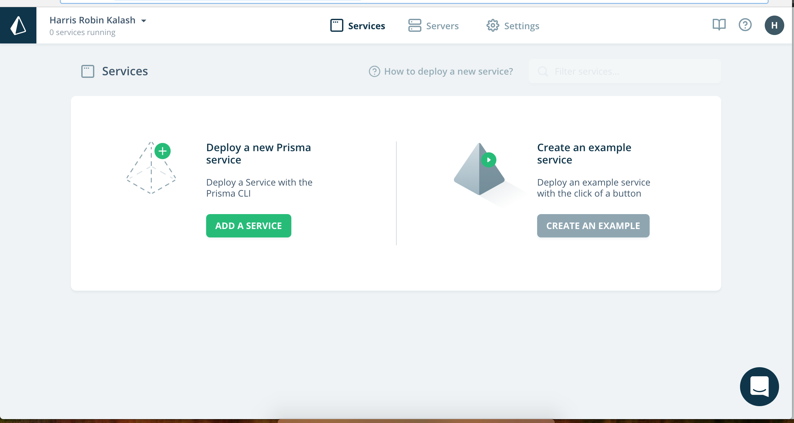
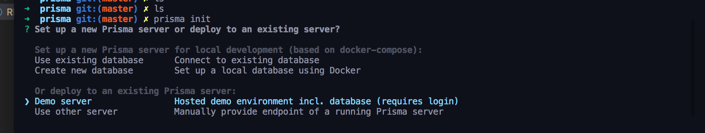
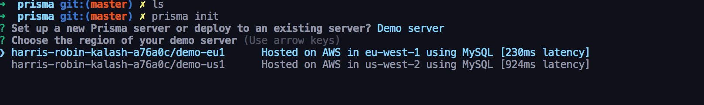
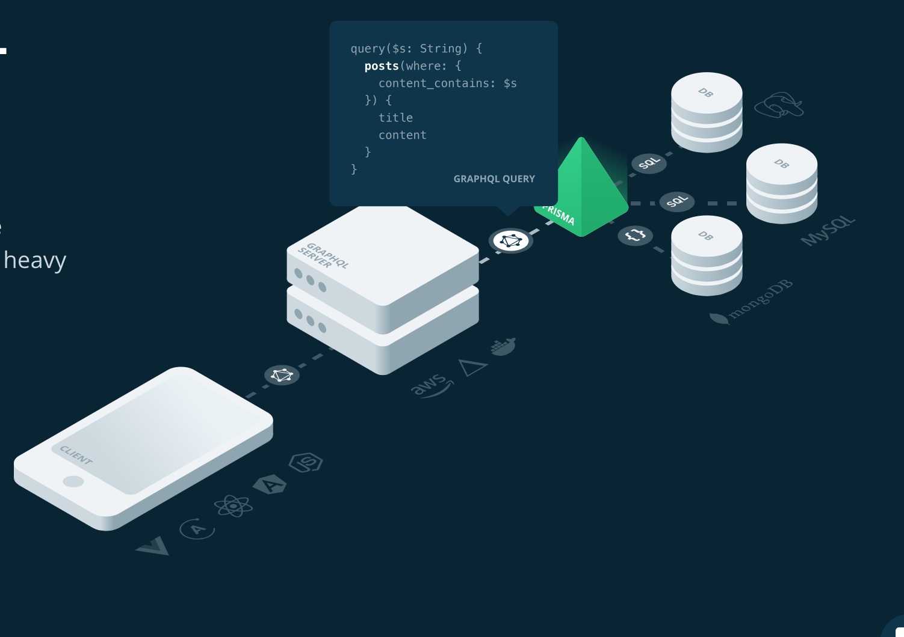
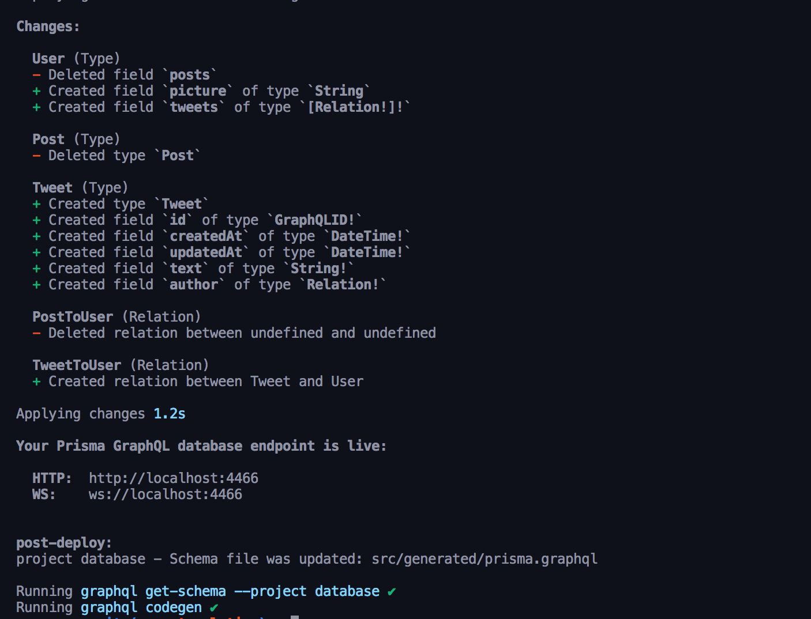
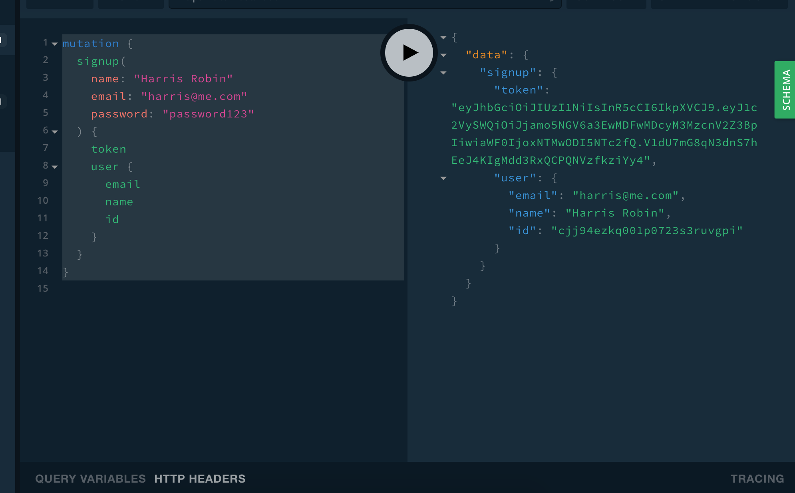

# ix-twatter

<p align="center">
  
</p>

## Getting Started

### Install Homebrew

Note: if you already have homebrew installed, you can skip this.

Installing Homebrew is effortless, open Terminal and enter : (MAC)

```sh
/usr/bin/ruby -e "$(curl -fsSL https://raw.githubusercontent.com/Homebrew/install/master/install)"
```

Note: Homebrew will download and install Command Line Tools for Xcode 8.0 as part of the installation process.

For windows users: https://dev.mysql.com/doc/workbench/en/wb-installing-windows.html

(let me know if you run into issues Max ;))

### Get the server up and running

in a new terminal window, CD into your server, install dependencies and deploy prisma.

1.  Globally install prisma and graphql-cli by running `npm install -g prisma graphql-cli`.
2.  `cd server`
3.  run `yarn install` to install depencies.
4.  create a prisma folder in your /server/ directory by running:
```sh
// make sure you are in your /server/ diretory.
mkdir prisma
```


### Run remote prisma instance.


1. Create an account on app.prisma.io
Navigate to `https://app.prisma.io/` and create an account by signing up. Feel free to login with github if you have an account or simply using email & password.


2. Once you are logged in, you will be presented with this screen:




Go ahead and click "ADD A SERVICE".

You should now see instructions on how to add a prisma service. If you have not done so already, run `npm install -g prisma` to install prisma globally on your machine.

In the second box you should see a `prisma login` command that you should copy. Go ahead and copy that command and paste it in your terminal to login:

Here's what that process looks like: 


Now you should be logged in to prisma inside your terminal. 

Next step is to run `prisma init`. Make sure you are still in your `/prisma` directory and go ahead and run this command

```sh
prisma init
```

By now you should see this:



Prisma is now asking you where you want your server to be located. You should see two options (EU & US). We will go ahead and pick Eu as it is the closest to us and has the lowest latency.



Now yous hould be presented with a series of questions to setup your project.

I have answered the following:

`? Choose a name for your service (prisma): twatter`

`? Choose a name for your stage (dev)` (simply click enter to have the default one get selected, `dev`).


Now Prisma will go ahead and create 2 new files, `prisma.yml` & `datamodel.graphql`. 

Go ahead and run `prisma deploy` in order to deploy your server. 

You should see your changes being pushed and now you are ready to start up your server.


Here is the datamodel we had during our lecture. Feel free to copy this inside `prisma/datamodel.graphql`.

```graphql
type Tweet {
  id: ID! @unique
  createdAt: DateTime!
  updatedAt: DateTime!
  text: String!
  author: User!
}

type User {
  id: ID! @unique
  email: String! @unique
  password: String!
  name: String!
  picture: String
  tweets: [Tweet!]!
}
```


After adding your changes to your datamodel.graphql, make sure to re-deploy prisma.

⚠️️️️️️️️️⚠️ You have to run `prisma deploy` every time you make a change to your `datamodel.graphql` file. ️⚠️⚠️

Run `prisma deploy` while being inside your /prisma folder to deploy the changes.

Now go back a directory up to your server by running `cd ..` and run `yarn dev` and you should see your playground 🍾


### Get the front-end up and running

1.  go into your front-end directory by doing `cd client`
2.  install dependencies by running `yarn`
3.  run the app by running `yarn start`

This should open a web app (react.js) running on port 3000 on localhost.

Note: We actually won't be using react.js much yet, expect this to be more relevant next week but it's good to make sure your front-end is running never the less!

---

## Prisma

Now that both our server and front-end are properly setup, let's start defining our schema. First, it's important to note that Prisma is generating Queries (reads) and Mutations (writes) for your database based on whatever you put in your datamodel schema file inside `prisma/datamodel.graphql`. Prisma runs on it's own and is it's separate thing. You still have your own graphql server running besides that, and your graphql server is in between your Prisma server & your client (in this case our react.js application).

This is important especially because Prisma literally generates all possible filters/sorting that you would want, on every type that you define and for every property. You will still need to pick and choose what you expose and perhapse define some custom logic in your own graphql-server if your needs are more than a simple read/write.

In other words, your Prisma service itself is never actually exposed to the client, only your graphql service can talk to it.

Here is the diagram from Prisma's own website to reiterate this point:



As you can see, Prisma is sitting in front of your database(s).

---

## Designing your _database_ schema

We're building a stripped down and simplified version of twitter. To be clear, the only features we are going to care about are the following:

- Authentication.
- Posting tweets.
- Following.
- Uploading a profile picture. (BONUS FEATURE! 🥓)

First, let's start by defining a User type. Our app has users, just like twitter's 😎.

```gql
type User {
  id: ID! @unique
  email: String! @unique
  password: String!
  name: String!
  picture: String
  tweets: [Tweet!]!
}
```

Most of these properties should be self explanatory, our user will have an ID and it's unique. By adding the `@unique` directive to our property, we let Prisma know that there can not be more than 1 user with the same ID. We do the same thing for emails. Also, our user has a bunch of tweets, so we attach a `tweets` property that will have an array of tweets, as you can see here : `tweets: [Tweet!]!`

Finally, our User also has an email and password because they will need to `authenticate` and log in. We don't want no anonymous tweets! This isn't blockchain.

Hold on! We almost forgot to create the Tweet type. Let's make sure this is defined:

```gql
type Tweet {
  id: ID! @unique
  createdAt: DateTime!
  updatedAt: DateTime!
  text: String!
  author: User!
}
```

In this case, the main point is that a Tweet is owned by a User and we define that relationship by giving the Tweet type an `author` property that links to the `User` type.

Now, in order to tell Prisma to make these changes run `prisma deploy` in your terminal. (make sure you are in the server repo).

Here is the expected output you should see in your terminal:



Finally, run `yarn build` as well in order to complile your typescript.

That's it for our schema for now. We'll get back to this and add some more things as we go! Now let's start creating some tweets and users.

## Authentication

The authentication part of the code is done for you, but let's walk through it step by step so that you understand it.

You will have to eventually allow your users to log in on the front-end!

So the first thing we are going to look at is our schema.graphql file. Let's open it up and see what's inside there so far:

```gql
# import * from "./generated/prisma.graphql"

type Query {
  feed: [Tweet!]!
  tweet(id: ID!): Tweet
  me: User
}

type Mutation {
  signup(email: String!, password: String!, name: String!): AuthPayload!
  login(email: String!, password: String!): AuthPayload!
}

type AuthPayload {
  token: String!
  user: User!
}

type User {
  id: ID!
  email: String!
  name: String!
  tweets: [Tweet!]!
}
```

As you can see, we have two mutations here. `signup` and `login`. They both take an email and a password and return an `AuthPayload` we've defined. This is what tells graphql what our mutations will look like, what parameters they take etc. We will now look at their _implementations_.

To see that, go to `src/Mutation/auth.ts`. Here's what it looks like:

```ts
import * as bcrypt from "bcryptjs";
import * as jwt from "jsonwebtoken";
import { Context } from "../../utils";

export const auth = {
  async signup(parent, args, ctx: Context, info) {
    const password = await bcrypt.hash(args.password, 10);
    const user = await ctx.db.mutation.createUser({
      data: { ...args, password }
    });

    return {
      token: jwt.sign({ userId: user.id }, process.env.APP_SECRET),
      user
    };
  },

  async login(parent, { email, password }, ctx: Context, info) {
    const user = await ctx.db.query.user({ where: { email } });
    if (!user) {
      throw new Error(`No such user found for email: ${email}`);
    }

    const valid = await bcrypt.compare(password, user.password);
    if (!valid) {
      throw new Error("Invalid password");
    }

    return {
      token: jwt.sign({ userId: user.id }, process.env.APP_SECRET),
      user
    };
  }
};
```

Let's break this signup function down line by line:

```ts
  async signup(parent, args, ctx: Context, info) {
    const password = await bcrypt.hash(args.password, 10)
    const user = await ctx.db.mutation.createUser({
      data: { ...args, password },
    })

    return {
      token: jwt.sign({ userId: user.id }, process.env.APP_SECRET),
      user,
    }
  },
```

First, we see our common arguments. Parent, args & ctx. These should already be familiar to you. As you can see, we pass `password` to this `bcrypt.hash` function which will take our user's password and hash it to make it secure. We've covered this a bit during our slides when we spoke about Authentication. All of this is the following:

```ts
const password = await bcrypt.hash(args.password, 10);
```

With the encrypted password, we then pass that to our `createUser` mutation which was created for us by Prisma. We are able to access all our mutations via this `db.mutation` object provided to us inside `ctx`. This will be very useful througout the project and you will use it a lot. If you ever need to access queries or mutations outside of your playground/client without using graphql syntax, ctx.db is your friend!

Here's the line of code:

```ts
const user = await ctx.db.mutation.createUser({
  data: { ...args, password }
});
```

We've now created the user with the hashed password. If you are seeing `...args` and are unfamiliar with it, this is called the spread operator in Javascript. It allows us to "spread" an object instead of having to insert assign every property of an object to a new object one by one.

All we are doing is simply passing the arguments, `email & password` and spreading it for a nicer/cleaner syntax. To be clear, the above is the equivalent of this:

```ts
const user = await ctx.db.mutation.createUser({
  data: { email: args.email, password: args.password }
});
```

Makes sense?
Please watch this video on the topic before you continue:
https://www.youtube.com/watch?v=Y7pVoDkwVLY

Now that we've finally created the user and hashed their password, we should give the user back a token (our secret that they can share with our server in order to be authorized).

This is what that looks like:

```ts
return {
  token: jwt.sign({ userId: user.id }, process.env.APP_SECRET),
  user
};
```

The way the token is generated is using this `jwt.sign` function. What this does is, using our `APP_SECRET` (This IS a very secret you should never share with the outside world. Think of it like a master password), the library `jwt` has generated a signed token using the user's `id` in our database (challenge question: why not use email instead?) and our secret.

Great, so now our `Mutation` object that is imported in `src/index.ts` has a signup method and our `schema.graphql` has also modeled it. This means that we can start using it!

Go ahead and create a user in your server.

With the following query:

```gql
mutation {
  signup(
    name: "Harris Robin"
    email: "harris@me.com"
    password: "password123"
  ) {
    token
    user {
      email
      name
      id
    }
  }
}
```

You should see something like this:



A user was created, we have their information and a _token_.
More on this _token_ business later though!

<p align="center">
  
</p>

Now your turn!

1.  Start by creating one of your tweet mutations! This one will be `createTweet`. It should do exactly what it sounds like and create a tweet.
1.  The way you create this mutation in graphql should be partly familiar to you and remain the same. What's different is that you now have a database, so remember to use that in your resolver!
1.  Here's how creating a tweet would look like in your resolvers:

```ts
const user = await ctx.db.mutation.createTweet({
  data: {
    text: args.text,
    author: {
      connect: {
        email: "harris@me.com" // make sure you use your created user's email!
      }
    }
  }
});
```

2.  Make a feed query that returns a list of all the tweets (this is our twitter feed!)

3.  Make a tweet query that returns a single tweet using an ID!
